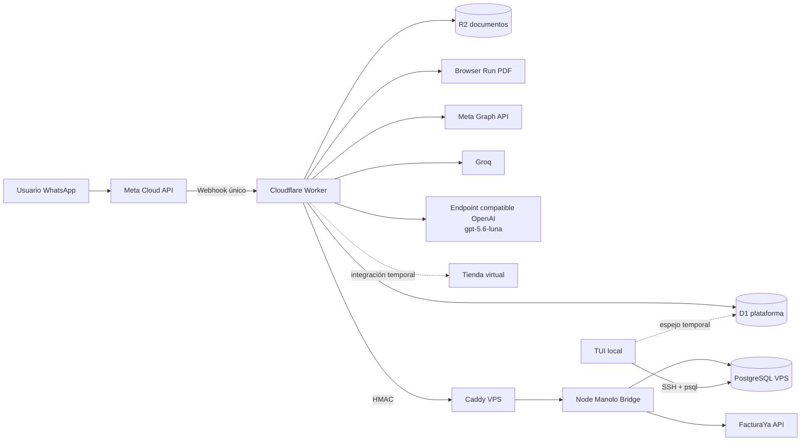
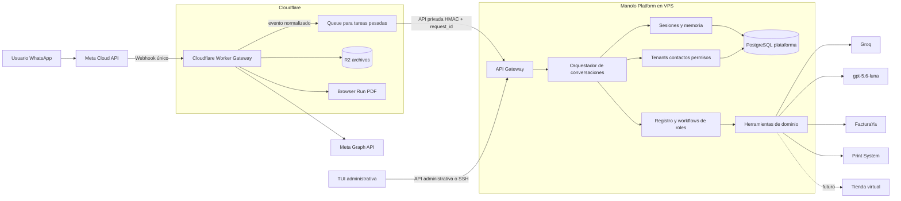

# Documento fundacional de arquitectura de Manolo

Estado: aprobado como dirección técnica inicial  
Fecha: 2026-08-26  
Alcance: plataforma WhatsApp multi-tenant, roles conversacionales e integración con servicios externos.

## 1. Decisión principal

Meta WhatsApp tendrá un único webhook registrado: el Cloudflare Worker.

El Worker será el gateway de entrada y salida. La lógica de negocio, la memoria
durable, la autorización por contacto y los flujos largos migrarán
progresivamente al VPS mediante la Manolo API.

```text
Worker = seguridad de Meta, normalización, entrega y compatibilidad edge
VPS    = orquestación, sesiones, roles, herramientas e integraciones
```

El Worker y el proceso Node del VPS no compiten por el mismo puerto ni por el
mismo webhook. Son componentes separados: Meta llama al Worker y el Worker
llama al VPS mediante una API privada autenticada.

## 2. Estado actual



### Responsabilidades actuales

- Meta entrega los eventos únicamente al Worker.
- El Worker valida la firma de Meta, deduplica mensajes y normaliza texto,
  audio, imagen, documento y respuestas interactivas.
- D1 conserva temporalmente tenants, conversaciones, historial, estados de
  roles, cotizaciones y compatibilidad con algunos flujos existentes.
- El VPS ya es la autoridad operativa para el control de contactos y roles, y
  expone el puente HMAC para `print-advisor`.
- PostgreSQL VPS contiene los esquemas `whatsapp` y `print_system`.
- El rol `print-advisor` consulta PostgreSQL en modo de solo lectura.
- Groq atiende roles generales, transcripción y visión.
- El rol empresarial usa el proveedor compatible con OpenAI y el modelo
  `gpt-5.6-luna`.
- FacturaYa sigue siendo la fuente de verdad de los comprobantes electrónicos.
- El Worker no conserva tokens FacturaYa. El puente resuelve la empresa activa,
  valida membresía y permisos y descifra el token únicamente durante la llamada.
- R2 y Browser Run permanecen en Cloudflare para documentos y generación de
  PDF; no se instala Chromium en el VPS mientras sus recursos no sean
  suficientes.

## 3. Arquitectura objetivo



### Fuente de verdad por dominio

| Dominio | Fuente de verdad objetivo |
| --- | --- |
| Tenants, contactos, roles y permisos | PostgreSQL VPS |
| Sesiones, memoria operativa e idempotencia | PostgreSQL VPS |
| Documentos y archivos temporales | R2 |
| Comprobantes electrónicos | FacturaYa |
| Datos operativos de impresión | PostgreSQL `print_system` |
| Diseño y catálogo de tienda | Tienda virtual, cuando se reactive |
| Envío y recepción de WhatsApp | Meta Cloud API a través del Worker |

D1 queda como compatibilidad durante la migración. No se debe utilizar como
segunda autoridad permanente para roles, contactos o sesiones.

## 4. LangChain y LangGraph

LangChain se utilizará como capa de modelos, herramientas y mensajes. LangGraph
se reservará para workflows con varios pasos, pausas, confirmaciones o
reanudación:

```text
cat                    -> handler directo
quotes                 -> QuoteWorkflow
enterprise-advisor     -> EnterpriseWorkflow
facturas y boletas     -> BillingWorkflow
store-designer         -> StoreWorkflow
print-advisor          -> handler o workflow pequeño con herramienta SQL
```

No se creará un grafo gigante para todos los roles. Cada workflow recibirá el
contexto común de tenant y contacto y ejecutará herramientas desacopladas como
`FacturayaService`, `PrintSystemRepository` y `WhatsAppGateway`.

El `thread_id` recomendado será:

```text
tenant_id:contact_id:session_id
```

La ventana de 20 minutos se controlará con `expires_at` en la sesión de la
plataforma. LangGraph conservará checkpoints para reanudar el flujo, pero no
será la única fuente de expiración ni de autorización.

## 5. Reglas de seguridad y consistencia

- El callback de Meta nunca se moverá a Vercel ni se duplicará en el VPS.
- Worker → VPS utilizará HMAC, timestamp, `request_id` y límite de tamaño.
- Cada tenant y contacto se validará en el servidor antes de ejecutar una
  herramienta.
- Las llamadas que produzcan efectos externos serán idempotentes.
- Emitir una factura, crear un pedido o registrar un pago requerirá una clave
  única y una validación final del precio y del estado.
- Los checkpoints no almacenarán imágenes ni PDFs completos; conservarán
  referencias a R2 y a los registros de dominio.
- Los logs usarán eventos estructurados, correlation ID y no incluirán secretos
  ni contenido sensible de los usuarios.

## 6. Plan de migración aprobado

### Fase 1: puente y control VPS

Completada parcialmente:

- PostgreSQL operativo en el VPS.
- TUI administrativa conectada por SSH.
- Resolución HMAC de roles.
- Puente de `print-advisor`.
- Fallback D1 temporal.

### Fase 2: autoridad de plataforma

Siguiente etapa:

- Definir contratos de la Manolo API para tenants, contactos, sesiones,
  conversaciones e idempotencia.
- Escribir en PostgreSQL y leer desde PostgreSQL como ruta principal.
- Mantener espejo D1 solamente para rollback.
- Añadir reconciliación y métricas de divergencia.
- Multiempresa FacturaYa implementado: membresías, empresa activa, integración
  cifrada, HMAC, idempotencia y auditoría en PostgreSQL.

### Fase 3: migración de memoria y estados

- Migrar historial y estados de roles a PostgreSQL.
- Usar una sesión explícita por contacto y ventana temporal.
- Conservar D1 en modo lectura durante el periodo de observación.

### Fase 4: workflows de negocio

- Migrar facturas y boletas.
- Migrar cotizaciones.
- Migrar el flujo de tienda cuando vuelva a estar en alcance.
- Mantener roles simples en el Worker hasta que exista una razón para moverlos.

### Fase 5: retiro de D1

- Respaldar D1.
- Comparar conteos y claves entre PostgreSQL y D1.
- Ejecutar pruebas de recuperación.
- Desactivar el fallback.
- Retirar bindings y migraciones D1 solo después de un periodo estable.

## 7. Criterio de finalización

La migración se considerará completa cuando el Worker pueda reiniciarse sin
perder estado, PostgreSQL sea la única autoridad de plataforma, los mensajes
duplicados no produzcan efectos duplicados, y cada rol pueda continuar una
sesión desde el último estado válido sin depender de D1.
