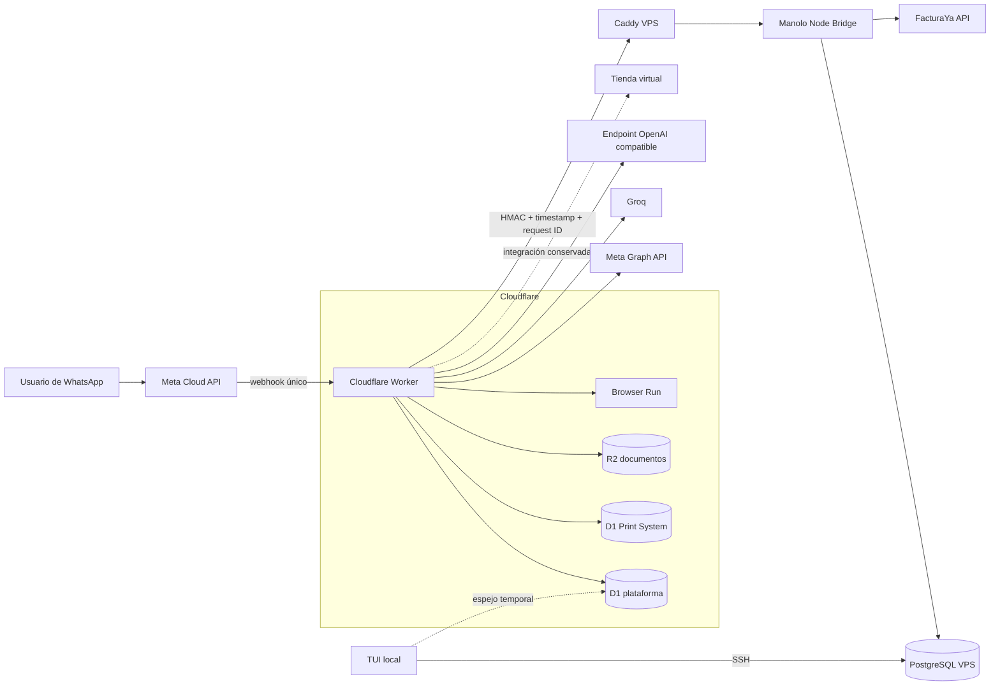

# Arquitectura actual

Fecha de corte: **2026-08-28**.

## Vista del sistema

## Flujo de un mensaje

1. Meta envía el evento a `POST /webhooks/whatsapp`.
2. El Worker verifica `X-Hub-Signature-256` sobre el cuerpo original y devuelve
   `200` rápidamente; el procesamiento continúa con `waitUntil`.
3. Se extraen mensajes e interacciones y se normalizan texto, audio, imagen o
   documento. Audio y visión aportan contexto al rol, no sustituyen su prompt.
4. D1 resuelve el tenant, carga historial y registra el mensaje. El ID de Meta
   evita procesarlo dos veces.
5. El Worker muestra el indicador de escritura y consulta el rol efectivo en el
   VPS. Si el bridge no responde, utiliza la asignación D1 temporal.
6. Cuando la escritura en sombra está activa, el mensaje también se replica en
   PostgreSQL con una clave idempotente.
7. `RoleRegistry` configura y ejecuta el handler. El handler recibe contratos
   para IA, datos, documentos y WhatsApp; la composición concreta vive en
   `src/index.ts` y `src/adapters/`.
8. La respuesta se envía por Meta Graph API, se persiste en D1 y se replica en
   PostgreSQL cuando corresponde.

## Frontera Worker ↔ VPS

El bridge acepta únicamente rutas conocidas y firmadas:

| Ruta lógica | Responsabilidad |
| --- | --- |
| Health | Comprobar proceso y base sin revelar información sensible |
| Resolución de rol | Obtener rol efectivo desde PostgreSQL |
| Sync inbound/outbound | Replicar mensajes e idempotencia en modo sombra |
| Print Advisor | Ejecutar la consulta analítica sobre la copia PostgreSQL |
| FacturaYa | Autorizar empresa/contacto y ejecutar operaciones multiempresa |

La firma incluye el cuerpo exacto. El bridge valida ventana temporal, firma y
request ID antes de interpretar el payload. FacturaYa agrega idempotencia por
hash de solicitud para impedir que la misma clave ejecute datos distintos.

## Fuentes de verdad actuales

| Dominio | Fuente de verdad |
| --- | --- |
| Callback y transporte de WhatsApp | Cloudflare Worker + Meta |
| Tenant lookup, conversaciones y deduplicación de runtime | D1 |
| Rol administrativo del contacto | PostgreSQL VPS |
| Fallback temporal de roles | D1 |
| Copia en sombra de mensajes | PostgreSQL VPS |
| Sesiones y estado específico de roles | D1, salvo estados FacturaYa del VPS |
| Contactos, membresías, permisos y credenciales FacturaYa | PostgreSQL VPS |
| Comprobantes electrónicos | FacturaYa |
| Cotizaciones y correlativos | D1 |
| Datos del negocio de impresión | PostgreSQL VPS para el bridge; D1 como compatibilidad |
| Archivos empresariales temporales | R2 |

## Endpoints públicos del Worker

- `GET /health`.
- `GET /webhooks/whatsapp` para verificación de Meta.
- `POST /webhooks/whatsapp` para eventos de WhatsApp.
- `POST /internal/store/payment` para notificaciones firmadas de tienda.

No se deben añadir endpoints administrativos sin autenticación ni exponer el
bridge Node directamente sin Caddy y HMAC.

## Arquitectura objetivo

El objetivo aprobado conserva el Worker como gateway liviano y desplaza
sesiones, memoria, idempotencia y workflows complejos hacia la plataforma VPS.
La definición completa, incluyendo el uso selectivo de LangGraph, está en
[`architecture-foundation.md`](../../apps/manolo-whatsapp-worker/docs/architecture-foundation.md).

La transición debe hacerse por tenant, con escritura en sombra, reconciliación,
rollback y un periodo estable antes de eliminar D1. No se interpreta el código
preparatorio de PostgreSQL como una migración ya terminada.
